This guide covers all you need to set up an expandable, one-stop shop monitoring system using open source tools. The primary audience of this guide is for Livepeer Orchestrators even if you have a monitoring system in place or not. When completed, you will be able to view all metrics and logs in one place as well as receive alerts when your node is not operating properly.

**Requirements**

- Two running Linux systems with Docker, the Docker Compose plugin and Git installed. One system will be your Orchestrator node where we install Promtail and the other will run your monitoring/alerting components.
- Domains (can be two subdomain A records) for each host machines.  This enables each system to communicate with one another using valid SSL certifcates. For example, orch-metrics.mydomain.xyz (for Orchestrator metrics) and monitor.mydomain.xyz (for Loki).
- Network connectivity between the two host machines via port 443.
  - Promtail to Loki: A DNS hostname for Promtail to connect to Loki.  The DNS should expose port 443 on Host Machine 2.
  - Promtheus to Orchestrator:  DNS name for Prometheus to connect to the Orchestrator metrics endpoint on port 443.  Alternate ports can be used and must be provided to the automated startup scripts or manually entered in the Livepeer job in the Prometheus scrape target (prometheus.yml).
- The Orchestrator node must be started with the metrics endpoint [enabled](https://docs.livepeer.org/guides/orchestrating/monitor-metrics) (e.g. pass the monitor flag during startup).

> **For non-Docker and Windows users**
The configuration files for the applications discussed in this guide can be used after installing each application per their respective projects' documentation (e.g Grafana, Loki, and so on). The exception would be the Docker compose files. These can be used to understand command line arguments and deployment topology.

>  **Docker Usage**
If you do not currently have Docker installed, you can follow the guides created by [Mike Zupper](https://github.com/RyanC92/NightNode_Livepeer_Docs/blob/main/Install/Docker/README.MD) (steps 1-4) or the [Docker official docs](https://docs.docker.com/engine/install/ubuntu/). After Docker has been installed, ensure you install [Docker compose](https://docs.docker.com/compose/install/). 

All Docker commands in this guide are shown using the sudo command.  This is not necessary if running the steps as the root user.  Rootless Docker is not supported due to the Traefik setup.

# TLDR Quickstart Setup

You can get going by running the commands below with the proper inputs. **The files will be installed in your home directory under ~/speedy-livepeer.** You must update the below commands by replacing the values prefixed with dollar signs per the following table.

| **Value to Replace** | **New Value** |
| --- | --- |
| $ORCHESTRATOR\_IP\_DNS | The IP address or DNS hostname of the Orchestrator node. Include the port if using something other than 80 or 443.  This only supports one Orchestrator.  Update the Prometheus configuration manually to add more.  If using an IP address, ensure it is reachable from Host Machine 2. |
| $TG\_BOT\_TOKEN | The token provided by the BotFather from the section [Create a Telegram Bot](#create-a-telegram-bot) |
| $TG\_CHAT\_ID | The chat id where you want to send alerts from the section [Configure Alertmanager Telegram Receiver](#configure-alertmanager-telegram-receiver) |
| $LOKI\_DNS | The DNS hostname for your Loki system on Host Machine 2.  Do not supply a port.  Port 443 is assumed.|
| $LOKI\_DNS\_Email | The email associated with your DNS provider for the Loki DNS |

Host Machine 2 is a standalone server running independently from your Orchestrator. Host Machine 1 is where your Orchestrator is installed. These systems must be able to reach one another, whether on the same network or not. See the [Deployment Model](#deployment-model) section explaining the specifics.

Let's start by setting up the Server Monitor first.

## Host Machine 2 (Server Monitor)

    curl -sL https://raw.githubusercontent.com/0xspeedybird/livepeer-monitoring-stack/main/server-monitor/bootstrap-server.sh | sudo bash -s -- -i $ORCHESTRATOR\_IP\_DNS -b $TG\_BOT\_TOKEN -c $TG\_CHAT\_ID -d $LOKI\_DNS -e $LOKI\_DNS\_Email

If you want to tweak pre-packaged [alert rules](#common-alert-conditions) or [retention](#configure-and-manage-storage) policies, you can read the sections below for specific settings and examples. You will have to restart the containers via Docker compose for the changes to take.

## Host Machine 1 (Client Monitor)

    curl -sL https://raw.githubusercontent.com/0xspeedybird/livepeer-monitoring-stack/main/client-monitor/bootstrap-client.sh | sudo bash -s -- -i $HOST\_MACHINE\_2\_DNS

**Congratulations, you've completed the TLDR speedy setup! 🎉🎉**

You should be able to view the Grafana dashboards by visiting Host Machine 2's URL @ "/grafana" (e.g. https://monitor.mydomain.xyz/grafana). The Grafana username and password is "admin" "admin".

Read on if you want to learn how it works in glorious detail. 🤓

# Full Guide

This guide will walk you through key settings and steps to deploy the server monitor followed by the client monitor.

## Deployment Model

A monitoring stack can consist of many components and come in many flavors. In this setup, we will deploy the following components. These are all based on open source software so there will be no need to purchase a license. All of the components chosen for this guide are battle tested and in production use at massive scale around the world today. So rest assured, this system can scale to your needs. The components are:

1. A metrics collection server with a built-in time-series database called [Prometheus](https://prometheus.io/).
2. A log aggregation server called [Loki](https://grafana.com/oss/loki/).
3. A log scraping agent called [Promtail](https://grafana.com/docs/loki/latest/clients/promtail/) that is responsible for pushing log data to Loki from remote systems.
4. A visualization tool to simplify the analysis of various metrics and logs from the aforementioned components. This tool is [Grafana](https://grafana.com/).
5. An edge router called [Traefik](https://doc.traefik.io/traefik/) to secure and publish services.
6. An alerting server capable to propogating alerts generated by Prometheus and Loki to various channels (Telegram in this case).  This is call [Alertmanger](https://prometheus.io/docs/alerting/latest/alertmanager/)

With any monitoring system, you will want to deploy it independently from the system it will monitor (the Orchestrator). This ensures that if your Orchestrator node runs into trouble, the monitoring system will continue to operate and send alerts. The resources the monitoring system will need will not contend with your production system under this model.

## Project Layout

Here's a quick view of the project layout to help you get oriented.  You can see how there are two different compose projects in this layout.

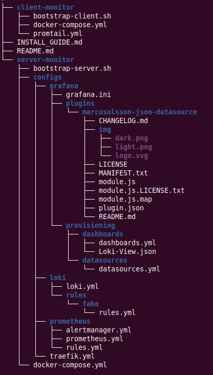

## Setup Server Monitoring Stack

Since we want to easily redeploy this stack, we will bundle everything together into a server monitor (deployed on host machine 2) and client monitor (deployed on host machine 1). The client monitor being the system where the Promtail client will be installed alongside our Livepeer Orchestrator.

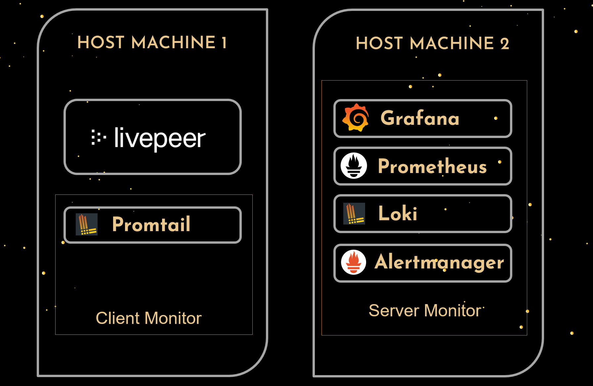

The server monitor will be the main system that monitors various sources of data, including the Livepeer installation. The client monitor will be responsible for sending log data to the server monitor. While the server monitor has the ability to pull metrics from remote systems, log data must be pushed to the server monitor using Promtail. Having a client monitor also enables us to expand which metrics are available as Livepeer only exposes [Livepeer-specific data](https://docs.livepeer.org/reference/go-livepeer/prometheus-metrics) and does not expose information we may be interested in like CPU or disk usage.

### Important Installation Notes

- Loki
  - **Loki is installed in a monolithic, single-binary mode. This is fine for small read/write volumes of up to approximately 100GB per day.** The install can be scaled out horizontally if desired. For the purposes of a Livepeer Orchestrator however, this is sufficient.
  - Loki supports multi-tenancy. In other words, you can have Loki pull logs from multiple systems and then isolate each set of data and queries by a tenant. This guide uses the default tenant shipped with Loki called "fake". While the name is an odd choice, you cannot change it as this is the value Loki expects out of the box when deploying only one tenant.  It is hardcoded into the system by the Loki project contributors.
- Security
  - **Grafana Password** : After you first login to Grafana, you may want to change the password to a more secure value or do this the first time directly in the docker-compose file before starting the stack. The setting in the compose file is called "GF\_SECURITY\_ADMIN\_PASSWORD" and is set to "admin".
  - **SSL Certifcate Generation** : SSL certificates are auto-generated via the LetsEncrypt provider in Traefik.  This requires you to provide the email address associated with your DNS provider to generate a certificate.  If provided, the certificate will be automatically generated and installed for use with Loki when the Docker compose project is brought up.  This will ensure all traffic sent to Loki is encrypted.  A non-encrypted option is not provided with this tutorial.
  - **Loki and Traefik Dashboard Passwords** : Passwords used by Traefik to protect the Loki API are required to set up the middleware authentication.  The plain text password is stored in the promtail.yml while the output of the command below is used in the docker-compose.yml for the server-monitor.  The default shipped with this tutorial is username of "loki" with password as the "password".
  
    `echo $(htpasswd -nb loki password) | sed -e s/\\$/\\$\\$/g`
  - **Grafana Password** : The Grafana username and password is "admin" "admin".  You will be prompted to change this during your first logon.

### Installation

First, let's grab the docker compose files and discuss key settings for the server monitor. As seen in the image above, this Docker compose configuration will deploy Prometheus, AlertManager, Grafana, and Loki on Host Machine 2.

1. Create a directory where you can check out the server monitor project on Host Machine 2.

    mkdir ~/speedy-livepeer
    cd ~/speedy-livepeer

1. Let's now create the requisite external volumes for data storage. External volumes are dedicated areas on Host Machine 2 where the various components of the stack will write their data. By making the volume external, they still exist on your machine but will live independently of the monitoring stack. In other words, when restarting, upgrading, deleting or otherwise altering the stack via Docker compose, the data stored on your hard drive will be durable and not overwritten.

Alertmanager and Loki are treated as ephemeral systems in this deployment that rely on external systems for data. As such, creating external volumes for these is not baked in or required.

    sudo docker volume create grafana_data
    sudo docker volume create prometheus_data
    sudo docker volume create loki_data

You can view the details of the volume with the command: "docker volume inspect" followed by the volumne name.  You will see the location of the volume in the output of this command.  The volumes usually are created under "/var/lib/docker/volumes".

1. From within the same directory, checkout the code from Github.

    git clone https://github.com/0xspeedybird/livepeer-monitoring-stack.git

2. Now that we have the project checked out, we can deploy the server stack.

    cd server-monitor
    sudo docker compose up -d

You should be able to view the Grafana dashboards by visiting Host Machine 2's URL @ "/grafana" (e.g. https://monitor.mydomain.xyz/grafana). The Grafana username and password is "admin" "admin".  They will most likely be showing errors as we still have to setup the client monitor.  We'll get to that in a moment.

### Configuration Settings

To simplify the deployment, all key configuration settings are either in the docker-compose.xml file or in a file within the "configs" sub-directory. Please see the third-party projects' documentation for more details regarding configuration options.

#### Custom Grafana Dashboards

New dashboards for automatic deployment can be placed in the "./configs/grafana/provisioning/dashboards" directory. Once there, you must restart Grafana (sudo docker compose restart grafana) to have Grafana recognize the new contents of the directory and deploy the dashboards stored there.

#### Custom Grafana Datasources

Data sources for Grafana follow a similar approach. If you need to define a new data source, simply add it to the data sources file located at "./configs/grafana/provisioning/datasources/datasource.yml". If you look at the one provided with this project, you will see the definitions provided out of the box. You will also notice that local data sources (local means deployed in the same Docker network) can be addressed with their container name values from the docker-compose.xml file rather than an IP address or externally required DNS name. In the examples below, this corresponds to the values in the url fields for Prometheus and Loki.

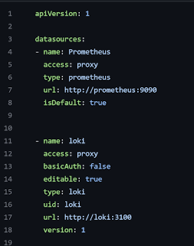

#### Grafana Plugins

Grafana plugins follow the same paradigm. Simply download any desired plugin, extract it to the plugins directory and restart Grafana. The directory is "./configs/grafana/plugins".

#### Prometheus Connection

The Prometheus connection string must be updated (if you didn't run the scripts from the TLDR section). The value should be the IP address or DNS hostname of your Orchestrator. Supply a port if using something other than 443. The config is located "~/speedy-livepeer/livepeer-monitoring-stack/server-monitor/configs/prometheus.yml".  Multiple Orchestrators can be added using a comma-separated list.

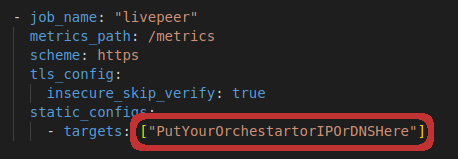

## Setup Client Monitor - Remote Log Capture

Now that we have our server monitor setup, we want to start pushing logs from the Orchestrator node on Host Machine 1 to Loki on Host Machine 2. All we need to do is follow the same pattern as before, but now we do it on Host Machine 1. The end result will be the Loki Promtail agent running on the machine. This tool pulls log files from the local machine and sends them to the Loki endpoint from the previous steps.

### Installation

1. Create a directory where you can check out the server monitor project on Host Machine 1.

    mkdir ~/speedy-livepeer
    cd ~/speedy-livepeer/

1. From within the same directory, checkout the server monitor code from Github.

    git clone https://github.com/0xspeedybird/livepeer-monitoring-stack.git

2. Now that we have the project checked out, we can deploy the client stack.

    cd livepeer-monitoring-stack/client-monitor
    sudo docker compose up -d

> **Errors in Logs on Startup**
When Promtail starts up, you _may_ see a number of errors related to either old logs being rejected (timestamp too old) or too many logs being sent to Loki (per stream rate limit exceeded).  These are temporary as Promtail sends the logs it discovers when first starting, and these could be a significant amount of logs initially.  The [Loki](https://grafana.com/docs/loki/latest/configuration/#limits_config) and [Promtail](https://grafana.com/docs/loki/latest/clients/promtail/stages/limit/) configurations for rate limiting and old logs are set to the default.  As a result, it will reject Promtail requests that are either too old or coming in to frequently/too large.  This is temporary, and the errors should go away as the systems work through their initial synchronization.
Here are sample logs showing what these errors look like:

    level=warn ts=2023-02-10T15:31:59.257493714Z caller=client.go:379 component=client host=monitor.mydomain.xyz msg="error sending batch, will retry" status=429 error="server returned HTTP status 429 Too Many Requests (429): entry with timestamp 2023-02-09 03:24:16.15167728 +0000 UTC ignored, reason: 'Per stream rate limit exceeded (limit: 3MB/sec) while attempting to ingest for stream '{container=\"my-orch\", type=\"livepeer\"}' totaling 238B, consider splitting a stream via additional labels or contact your Loki administrator to see if the limit can be increased' for stream: {container=\"my-orch\", type=\"livepeer\"},"
    level=error ts=2023-02-10T15:27:55.613199635Z caller=client.go:390 component=client host=monitor.mydomain.xyz msg="final error sending batch" status=400 error="server returned HTTP status 400 Bad Request (400): entry for stream '{container=\"my-orch\", type=\"livepeer\"}' has timestamp too old: 2023-02-03T01:38:05Z, oldest acceptable timestamp is: 2023-02-03T15:27:55Z"

> **Selecting Promtail as the Loki Client**
While Loki provides many [clients](https://grafana.com/docs/loki/latest/clients/), including a [Docker](https://grafana.com/docs/loki/latest/clients/docker-driver/) plugin, the [Promtail](https://grafana.com/docs/loki/latest/clients/promtail/) client was chosen for this project. The main reason is that Promtail provides support for retrieving logs from the entire system rather than Docker alone. As your usage scales, this will become valuable. For example, you may decide to pull other logs files from software and hardware components not present in the Docker logs.

### Configuration Settings

All Promtail scrape configurations are located in the promtail.yml file. The configurations determine which container log files will be sent to our server and which labels to extract from the text to aid in searching at a later time. The configuration shipped here extracts logs from all containers visible to the stack.

#### Connect Promtail to Loki

On Host Machine 1 (Client Monitor), you will need to update the Promtail configuration to set the URL to point to Host Machine 2. To do this, navigate to the promtail.yml file under ~/speedy-livepeer/livepeer-monitoring-stack/client-monitor and update the address for the URL setting to that of Host Machine 2 (Server Monitor).

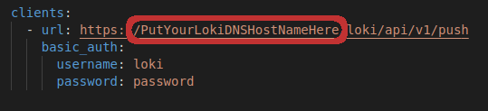

#### Advanced - Filtering Containers

While not configured in this project by default, you can filter from which containers Promtail will retrieve logs. This can be desirable to reduce overhead or filter out undesirable or sensitive log data. To do this, one would add a label to the Docker containers you wish to filter.  For example, let's add the following filter to an Orchestrator's container:

     labels:
      - "compute.type=livepeer"

Next, we update the docker_sd_config section in our promtail.yml with a filter for our label:

    docker_sd_configs:
    - host: "unix:///var/run/docker.sock"
      refresh_interval: 15s
      filters:
        - name: label
          values: ["compute.type=livepeer"]

### Cardinality

Cardi-what?! Nope, this isn't one of SpeedyBird's cousins. Cardinality is a topic of Set Theory or Mathematical Sets. If you want your hard drive and log queries to perform well, you need to be aware of how to avoid a cardinality explosion.

When Loki pulls in your log files, it tries to extract keywords (labels) and values against which you can query them. The more labels you have, the more Loki will break up the log content into separate chunks and streams. This doesn't mean don't use labels but do avoid using _dynamic_ labels in your scrape configurations unless you really, _really_ need to. A dynamic label would be something that changes like an IP address or session ID. 

The diagram below illustrates how Loki's [write-path architecture](https://grafana.com/docs/loki/latest/fundamentals/architecture/#write-path) works.  This gives an inside view of how logs are broken down and indexed.

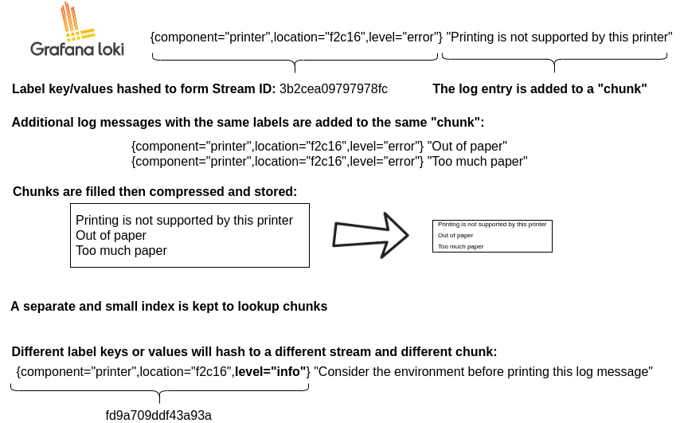

To better understand this, let's go over an example. Say you wanted to extract the transcoding session id from the logs as a label. Well since this value is unique, it is constantly changing. Having set up Loki to do this, you will be easily able to see all the sessions and search for them. Awesome, right? Well not so fast as Loki will store each session's log entries as a separate file on disk now. Since the session ids are short lived, you will have a ton of small files on disk stored by Loki for very little return. Per the Loki [docs](https://grafana.com/blog/2020/04/21/how-labels-in-loki-can-make-log-queries-faster-and-easier/#cardinality), "high cardinality causes Loki to build a huge index (read: $$$$) and to flush thousands of tiny chunks to the object store (read: slow)".

They key takeaway? Avoid the temptation of thinking of Loki as a database. Loki is more of a distributed data processor similar to map-reduce. If you want to search by dynamic values in log entries, use Loki's robust query language, [LogQL](https://grafana.com/docs/loki/latest/logql/). You can even chain expressions using pipelines ( expr1 | expr2 | expr3).

## Review Logs and Analytics

### Data Exploration

Now that you've got everything up and running, you can explore the logs by logging into Grafana and navigating to the "Explore" menu option on the left. Once there, select Loki from the drop down. You should now be able to run some queries against the logs Loki has indexed.

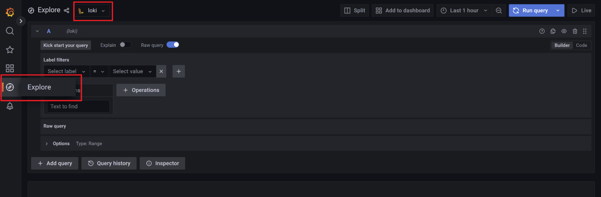

### LogQL

- The syntax of the LogQL query language is beyond the scope of this document. You can however take sample logs and test different expressions against them in Grafana's Explore section shown above or the Loki project's [LogQL Analyzer Online](https://grafana.com/docs/loki/latest/logql/analyzer/).

### Out of the Box Metrics

A selection of key metrics and thresholds have been shipped as alerts and are detailed in the [Common Alert Conditions](#common-alert-conditions) section below. Here we will explain one of the conditions that monitors Livepeer's block watcher (block watcher is what keeps Livepeer synchronized with the current state of the Arbitrum chain).

This straightforward expression will search for all logs labeled as type "livepeer" for the entries with the value of "blockwatch.Watcher error encountered". It will then determine how many times (count\_over\_time) this occurs over a five minute period ([5m]).

If you were to get results from this query, it is very likely that your system will experience a severe issue at some point (hopefully not right now!). While the exact root cause is unknown from this message alone, the results of the query would return log entries enabling us to dig deeper and even download the log file associated with these entries. For example, the results below show us that the remote "read: connection reset by peer". Peer in this case is our L2 JSON-RPC provider (for example, Infura). In other words, the error occurred remotely. It could be the L2 provider or a network connection in between failed.

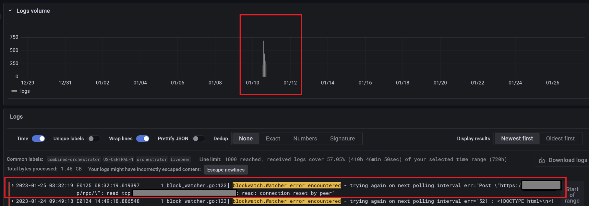

Taken to the next level, we can even use a similar query to set up a dashboard like the one below. This one extracts the block number last scanned by Livepeer on Host Machine 1, compares it to the the last block published by Arbitrum, and then provides a Red-Yellow-Green dashboard for us to quickly see the health of block polling.

Building upon this, we can have our system send us a notification whenever the system throws errors. In fact, that's what we'll discuss next.

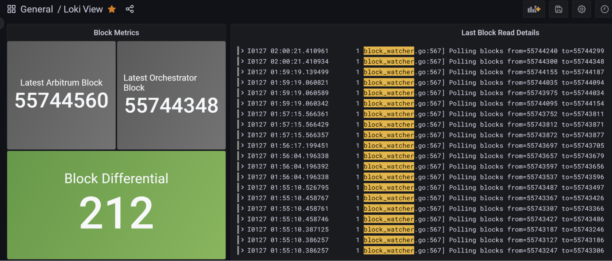

## Setting up Proactive Telegram Alerts

As part of the server monitoring stack, AlertManager has also been deployed. Alertmanager is integrated with both Loki and Prometheus. This enables us to define conditions in either system that will then send alerts via Telegram. You can configure the stack to send alerts to other systems. Alertmanager calls these systems "receivers". See the Alertmanager [documentation](https://prometheus.io/docs/alerting/latest/configuration/) for more details.

### Create a Telegram Bot

We are going to use Telegram's BotFather to create our own private bot that can receive alerts and send us notifications. Follow the steps here to set up your own bot.

1. Go to [https://t.me/BotFather](https://t.me/BotFather)
2. Send the **/newbot** command in your chat with the BotFather and give your bot a name. Type this name in and press Enter.
3. Give your bot a recognizable _@username_ (no spaces, English symbols, and digits, must end with _\_bot_).
4. Ready! Copy the access token that _@BotFather_ provided. We will use this to configure AlertManager in the next section.

### Configure Alertmanager Telegram Receiver

To send alerts, we will need to create a private Telegram Group with our bot and the user you wish to access the chat with (the user you log in to Telegram with). The regular user is assumed to exist already.

1. Create Group and Retrieve the Chat ID
  - Create a private group in Telegram
  - Retrieve the chat's id for later configuration by going to [https://web.telegram.org/](https://web.telegram.org/) and opening the group you created.
  - Once the group is opened, the URL in your browser should look something like [https://web.telegram.org/k/#](https://web.telegram.org/k/#-800364555)[**-800364555**](https://web.telegram.org/k/#-800364555)
  - All the text following the pound sign (including the leading dash) is the chat id. In this example, the chat id is "-800364555".
2. Add Chat ID and TG Bot Token to alertmanager.yml by replacing the dummy values for chat\_id and bot\_token located at ~/speedy-livepeer/livepeer-monitoring-stack/server-monitor/configs/prometheus/alertmanager.yml
3. Restart alertmanager

   `sudo docker compose restart alertmanager`

That's it! You will now get alerts through Telegram that look similar to the test alerts below. See the [Common Alert Conditions](#common-alert-conditions) section for a description of the provided alerts.

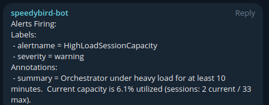

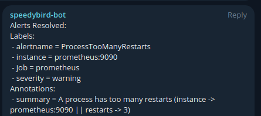

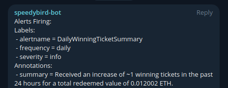

### Common Alert Conditions

The following alert rules are pre-packaged with this repository.

- Prometheus (~/speedy-livepeer/livepeer-monitoring-stack/server-monitor/configs/prometheus/rules.yml)
  - **InstanceDown** -\> Orchestrator metrics are not reachable
  - **HighLoadSessionCapacity** -\> Orchestrator sessions exceeded 85% of the max available sessions.
  - **ProcessTooManyRestarts** -\> A process has had more than two restarts within the last 15 minutes. This indicates potential stability issues.
  - **DailyWinningTicketSummary** -\> A daily summary of tickets received. This is an approximation due to Prometheus scrape intervals.
- Loki (~/speedy-livepeer/livepeer-monitoring-stack/server-monitor/configs/loki/rules/fake/rules.yml)
  - **BlockwatchFailure** -\> Blockwatch errors indicate a potential issue with your Arbitrum RPC endpoint.
  - **OrchestratorOverloaded** -\> The Orchestrator is overloaded and is throwing "_OrchestratorBusy_" errors.
  - **GasPriceTooHigh** -\> Gas prices are too high to execute transactions (per Orchestrator configuration). Unlikely to occur since Arbitrum Nitro upgrade in 2022.
  - **FailedSegementUpload** -\> May indicate bandwidth issues.
  - **InsufficientFunds** -\> The configured address does not have enough funds to operate (e.g. redeem tickets).
  - **TicketExpired** -\> Expired tickets were found. You may need to review them manually and potentially [mark them as redeemed](https://gist.github.com/yondonfu/ea57cfe9510b6526288d456229a3d61e).

You may want to consider adding additional rules to monitor remaining storage, CPU overload, bandwidth issues, and so on. See the last section on expanding your library for more examples.

## Advanced Next Steps

### Configure and Manage Storage

#### [Prometheus](https://prometheus.io/docs/prometheus/latest/storage/)

- **By default, Prometheus will delete older data and has no limit on the size of its database within the 15 day window**. The below settings can be provided as command line arguments to Prometheus in the Docker compose file. The code repository shipped with this guide does not specify any values as the defaults are sensible.
- [Configuration of Retention and Defaults](https://prometheus.io/docs/prometheus/latest/storage/#operational-aspects)

  - --storage.tsdb.retention.size

	The maximum number of bytes of storage blocks to retain. The oldest data will be removed first. **Defaults to 0 or disabled.**

  - --storage.tsdb.retention.time

	 When to remove old data. **Defaults to 15d** Increase this is if you want more data but be aware of the possible disk requirements to store data for longer periods.

- Retention Planning
  - Prometheus stores an average of only 1-2 bytes per sample. Thus, to plan the capacity of a Prometheus server, you can use the rough formula:

    `needed_disk_space = retention_time_seconds * ingested_samples_per_second * bytes_per_sample`

#### [Loki](https://grafana.com/docs/loki/latest/operations/storage/)

- [Retention](https://grafana.com/docs/loki/latest/operations/storage/retention/)
  - By default when retention configuration flags are not set, logs sent to Loki live forever.
  - There are two ways to enable the deletion of old data, TableManager and Compactor. The Compactor is more capable as it cleans up indexes as well as table storage in the Loki database. So, this guide will only focus on the Compactor as it is more robust, comprehensive and will have long term support from the Loki project.
  - Compactor is a service that reduces the index size by deduping the index and merging all the files to a single file per table.
  - [Configuration](https://grafana.com/docs/loki/latest/configuration/): **the following image shows the retention policy setup with the aforementioned code repo provided in this post.** The comments in the image explain the pertinent settings.

    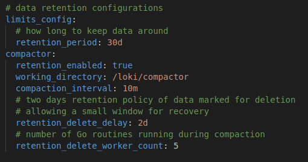

### Expand Your Alert Library

There are endless resources online to teach you more about configuring rules and alerts. Here are some nice examples of rules you can review for inspiration. Remember though, some of these metrics may not be exposed or available by default and so you might need to add some new metrics endpoints for Prometheus. A good starting point would be to setup [node\_exporter](https://github.com/prometheus/node_exporter#node-exporter) in the client monitor for system level metrics. Always keep in mind the additional load each service you add to your stack and it's overall impact on compute, storage, performance, and security.

- Deploy Loki mixins -\> [https://github.com/grafana/loki/tree/main/production/loki-mixin](https://github.com/grafana/loki/tree/main/production/loki-mixin)
- Deploy Awesome Alerts -\> [https://awesome-prometheus-alerts.grep.to](https://awesome-prometheus-alerts.grep.to/)

You've completed the Power Up! Be well and bye for now. 👋 👋 
